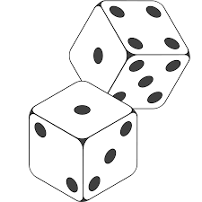

# repo-partnerproject
This is a repository to hold a simple description of 3 group members.
<<<<<<< Updated upstream
=======

## Gavyn Karl!

1. My name is Gavyn Karl, i am a 17 year old guy who just wants to make a mark and make a life out there. I live in london, but i use to live in kitchener, and was born in owen sound.
2. My hobbies include making music, working with art, and soon, code as well. I plan to work with a lot more opportunities with designing and coding to improve my skills with art and music, as well as for website design, which is a huge passion of mine. I'm quite interested in "probability" concepts, such as gambling, or just simple dice rolling games. I have never gambled once in my life, and if i do, i sure don't plan to go crazy, but the concept is really interesting to me as a whole.
3. This is my first ever program at Fanshawe! I've never actually been to a college before, so in all, living in a place with someone else and handling school is actually pretty scary to me, but i'm handling quite well, i hope! I'm trying to keep up with my workflow and entertainment, that way im not missing out on anything, and my grades are high.

>>>>>>> Stashed changes
